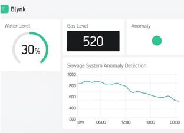
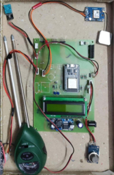
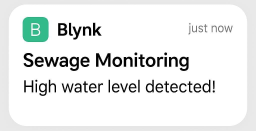

# 🚰 Smart Sewage Monitoring System

An **IoT-enabled, real-time sewage monitoring system** using threshold-based anomaly detection, GSM alerts, and cloud visualization via the Blynk IoT platform — as described in the IEEE paper:

> *"An IoT-Enabled Smart Sewage System for Real-Time Detection and Machine Learning-Based Prediction"*  
> T. Vijayakumar, Logesh K, S Dhivya Shree, Sakthi Dharshini C, Sharan M S, Sreya Shinu  
> Department of Information Technology, Dr. N.G.P. Institute of Technology, Coimbatore, India

---

## 📊 System Performance

| Sensor / Model    | Accuracy | Precision | Recall | F1-Score |
|-------------------|----------|-----------|--------|----------|
| Ultrasonic Sensor | 0.95     | 0.94      | 0.96   | 0.95     |
| Gas Sensor MQ-135 | 0.93     | 0.91      | 0.95   | 0.93     |
| **Combined System**   | **0.97** | **0.96**  | **0.98** | **0.97** |

Cross-validation mean: **96.5%** over 5 trials.

---

## 📸 System Screenshots

| Blynk Dashboard | Hardware Prototype | Alert Notification |
|---|---|---|
|  |  |  |

---

## 🏗️ System Architecture

```
┌─────────────────────────────────────────────────────┐
│                    SENSOR LAYER                     │
│  Ultrasonic (HC-SR04) │ Gas (MQ-135) │ DHT11 │ pH  │
└────────────────────┬────────────────────────────────┘
                     │ Sensor Data
┌────────────────────▼────────────────────────────────┐
│               PROCESSING LAYER                      │
│          ESP32 / Arduino Uno  +  SIM800L            │
└────────────────────┬────────────────────────────────┘
                     │ GSM / Wi-Fi
┌────────────────────▼────────────────────────────────┐
│             COMMUNICATION LAYER                     │
│              GSM Module  │  Wi-Fi Module            │
└────────────────────┬────────────────────────────────┘
                     │ MQTT / HTTP
┌────────────────────▼────────────────────────────────┐
│                  CLOUD LAYER                        │
│         Blynk IoT Dashboard + SMS Alerts            │
└─────────────────────────────────────────────────────┘
```

---

## ⚙️ Anomaly Detection Logic

**Water Level (Equation 1):**
```
D ≤ D_threshold  →  Trigger Overflow Alert
```
where `D_threshold = 50 cm`

**Gas Concentration (Equation 2):**
```
G ≥ G_threshold  →  Trigger Gas Leak Alert
```
where `G_threshold = 300 ppm`

---

## 🗂️ Repository Structure

```
smart-sewage-system/
│
├── arduino/
│   └── smart_sewage_monitor.ino    # Main ESP32/Arduino firmware
│
├── ml/
│   ├── train_model.py              # ML training, evaluation, plots
│   └── simulate_realtime.py        # Terminal simulation (no hardware needed)
│
├── dashboard/
│   └── index.html                  # Standalone web dashboard (open in browser)
│
├── tests/
│   └── test_system.py              # pytest unit + integration tests
│
├── docs/
│   └── wiring_diagram.md           # Hardware wiring instructions
│
├── requirements.txt
└── README.md
```

---

## 🛠️ Hardware Components

| Component                 | Quantity | Purpose                        |
|---------------------------|----------|--------------------------------|
| ESP32 (or Arduino Uno)    | 1        | Microcontroller                |
| HC-SR04 Ultrasonic Sensor | 1        | Water level detection          |
| MQ-135 Gas Sensor         | 1        | Hazardous gas concentration    |
| DHT11 Sensor              | 1        | Temperature & humidity         |
| SIM800L GSM Module        | 1        | SMS alert communication        |
| 16×2 LCD Display (I2C)    | 1        | Local real-time display        |
| Breadboard + Jumper Wires | —        | Circuit assembly               |
| 5V DC Power Supply        | 1        | Power                          |

---

## 🚀 Getting Started

### 1. Arduino / ESP32 Firmware

**Install Arduino Libraries** (via Library Manager):
- `Blynk` by Volodymyr Shymanskyy
- `DHT sensor library` by Adafruit
- `LiquidCrystal_I2C` by Frank de Brabander

**Configure credentials** in `arduino/smart_sewage_monitor.ino`:
```cpp
#define BLYNK_TEMPLATE_ID   "YOUR_TEMPLATE_ID"
#define BLYNK_AUTH_TOKEN    "YOUR_AUTH_TOKEN"
const char* WIFI_SSID       = "YOUR_WIFI_SSID";
const char* WIFI_PASSWORD   = "YOUR_WIFI_PASSWORD";
const char* ALERT_PHONE     = "+91XXXXXXXXXX";
```

**Upload** to your ESP32 via the Arduino IDE.

---

### 2. Python ML Pipeline

```bash
# Install dependencies
pip install -r requirements.txt

# Train and evaluate all models
cd ml
python train_model.py

# Run real-time terminal simulation (no hardware needed)
python simulate_realtime.py
python simulate_realtime.py --samples 30 --interval 1.5
```

---

### 3. Web Dashboard

Open `dashboard/index.html` directly in any browser — no server required.

Features:
- Live-updating sensor cards with colour-coded status
- Anomaly banner with alert details
- "Inject Anomaly" button for demo/testing
- Scrollable event log

---

### 4. Run Tests

```bash
pip install pytest
pytest tests/test_system.py -v
```

---

## 📡 Blynk IoT Setup

1. Create a free account at [blynk.cloud](https://blynk.cloud)
2. Create a new **Template** → add Datastreams:
   | Virtual Pin | Name         | Type  | Units |
   |-------------|--------------|-------|-------|
   | V0          | Water Level  | Float | cm    |
   | V1          | Gas Level    | Int   | ppm   |
   | V2          | Temperature  | Float | °C    |
   | V3          | Humidity     | Float | %     |
   | V4          | Anomaly LED  | Int   | —     |
3. Add **Events**: `water_overflow`, `gas_leak`, `high_temp` with notifications enabled
4. Copy your **Auth Token** into the firmware

---

## 📈 ML Models Evaluated

- Random Forest *(best performer)*
- Gradient Boosting
- Support Vector Machine (RBF kernel)
- Logistic Regression
- Threshold-Based Rule System *(embedded firmware baseline)*

All models trained on sewage parameters: **pH, Temperature, Turbidity, COD, BOD, TDS, Ammonia**

---

## 🔮 Future Scope

- AI-based predictive maintenance using LSTM / transformer models
- Solar-powered wireless sensor nodes
- COD, BOD, ammonia sensor integration
- Dedicated mobile application
- Integration with smart city infrastructure APIs

---

## 📄 Citation

If you use this work, please cite:

```
T. Vijayakumar et al., "An IoT-Enabled Smart Sewage System for Real-Time Detection 
and Machine Learning-Based Prediction," IEEE, 2024.
Dr. N.G.P. Institute of Technology, Coimbatore, India.
```

---

## 📜 License

MIT License — see [LICENSE](LICENSE) for details.
